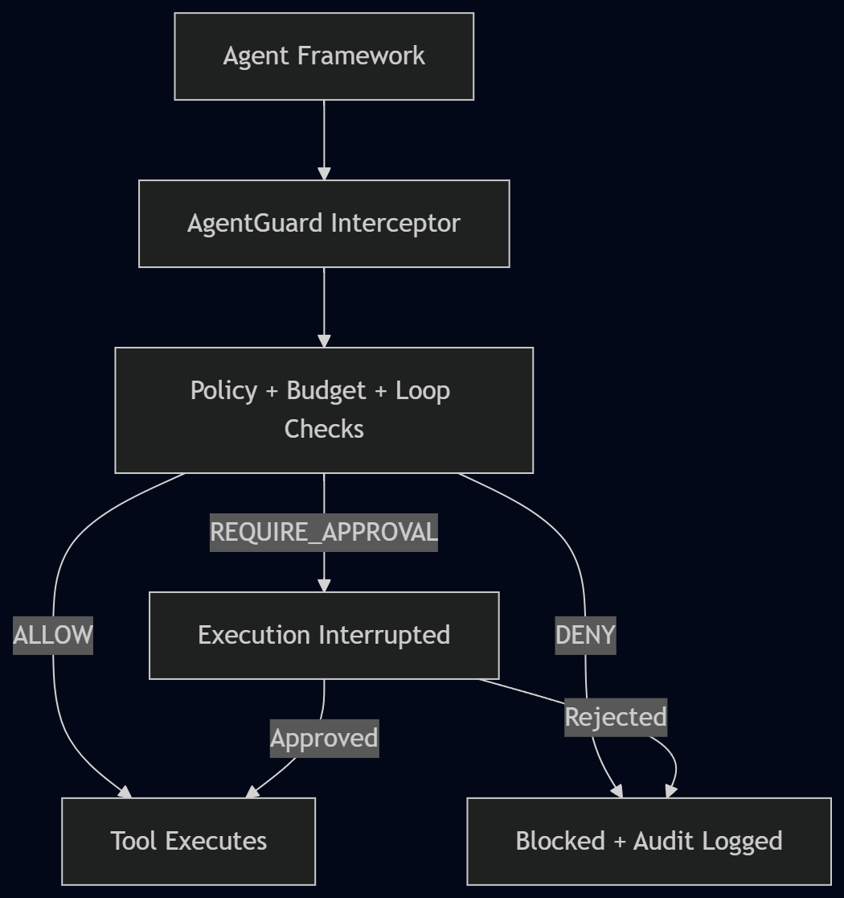

# AgentGuard

**Prevent AI agents from executing unsafe tools before they run.**

Runtime policy enforcement for AI agent tool execution. No LLMs in the decision path.

```bash
pip install -e .
````

```python
from agentguard import AgentGuard, ApprovalRequiredException

guard = AgentGuard.from_policy("policy.yaml")

@guard.tool
def wire_transfer(account_id: str, amount: float) -> dict:
    return payment_service.transfer(account_id, amount)

try:
    wire_transfer("ACC123", 5000.00, run_id="run-1")
except ApprovalRequiredException as e:
    approval_id = e.approval_id   # real wire_transfer() was never called

guard.approve(approval_id, approver="alice")
result = wire_transfer("ACC123", 5000.00, run_id="run-1")  # now it actually runs
```

```yaml
# policy.yaml
version: "1.0.0"
rules:
  - name: approve_wire_transfer
    tool: wire_transfer
    action: require_approval
```

---

## How It Works

<p align="center">
  
</p>

Policy is plain YAML, evaluated deterministically—same input, same policy version, same output, every time.

Every decision is deterministic: no network calls, no model inference, and no heuristic risk scoring.

The diagram above shows the high-level execution flow.

For the complete runtime decision flow, execution precedence, approval lifecycle, and architecture details, see [Architecture](docs/ARCHITECTURE.md).

---

## Why Runtime Governance, Not Observability

An agent doesn't need to be malicious to call `delete_customer` with the wrong ID, retry a failing tool twenty times, or send an email to thousand people because a prompt was ambiguous. Tracing tools will show you this happened, with a beautifully rendered timeline, after the damage is done. That's observability—it answers "what happened," not "should this happen?"

| | Observability | Runtime Governance |
|---|---|---|
| Acts | After execution | Before execution |
| Answers | "What happened?" | "Should this happen?" |

AgentGuard focuses on the second problem. LangSmith and similar tools focus on the first—they're complementary, not competing. If your problem is "I don't know what my agent did," that's observability. If it's "I need to guarantee my agent cannot do X," that's this.


## See It Run

This is real, runnable code—try it with `python demos/demo.py`. No API key or network access is required.

```text
$ python demos/demo.py

======================================================================

DEMO 1: Wire Transfer Approval Flow

Agent attempts to wire transfer $5,000.00 to account ACC123

BLOCKED. Approval required.

Approval ID: <approval-id>

Reason: Wire transfers require human authorization before executing

Checking pending approvals...

1 pending approval(s):

-> <approval-id> | wire_transfer | PENDING

Human approver 'alice' approves <approval-id>

Approved.

Agent retries the same wire transfer call (resuming after approval)

[TOOL EXECUTED] Wire transfer: $5,000.00 -> ACC123

Transfer completed: {'status': 'transferred', 'account_id': 'ACC123', ...}

Demonstrating a permanently denied tool: delete_customer

DENIED outright. Reason: Deleting customers is never permitted by agents
```

Two more scenarios—loop detection and budget exhaustion—follow in the same script.


## Design Goals

- ✓ Deterministic — no model judgment calls in the decision path
- ✓ Local-first — SQLite + a YAML file, no required cloud service
- ✓ Thread-safe — verified under real concurrent load
- ✓ Framework-agnostic — wraps the tool, not the framework
- ✓ Zero cloud dependency
- ✓ Zero LLM dependency


## Status

**MVP complete. 224 automated tests, all passing**, including real concurrency tests (100 threads racing on a shared counter, concurrent approval resolution races) rather than sequential-call smoke tests.

| | |
|---|---|
| ✓ | Policy Engine — YAML validation, hot-reload, deterministic evaluation |
| ✓ | Decision Engine — policy + budget + loop arbitration |
| ✓ | Approval Manager — idempotent requests, expiration, conflict-safe resolution |
| ✓ | Audit Logger — append-only, no update/delete method exists in the codebase |
| ✓ | Interceptor + public API — `@guard.tool`, sync and async |
| • | LangGraph adapter |
| • | OpenAI Agents SDK adapter |
| • | Policy testing framework |

A handful of real bugs were found and fixed by running the test suite against real code rather than by inspection alone — a policy-reload race condition, a foreign-key handling gap, and an argument-binding order bug that made approval idempotency depend on positional vs. keyword calling style. All fixed, each with a dedicated regression test.

---

## API Reference

```python
guard = AgentGuard.from_policy(policy_path, db_path="./agentguard.db")

@guard.tool                          # decorator; sync or async, auto-detected
def my_tool(...): ...

guard.approve(approval_id, approver: str, notes: str = "")
guard.reject(approval_id, approver: str, notes: str = "")
guard.get_pending_approvals() -> List[ApprovalRecord]
guard.get_run_audit(run_id) -> List[AuditRecord]
guard.reload_policy()                # hot-reload, atomic
guard.reset_run(run_id)              # clears in-memory budget/loop state
```

---

## Running the Tests

```bash
pip install -e ".[dev]"
python -m pytest tests/ -q
```

---

## Roadmap

1. LangGraph adapter
2. OpenAI Agents SDK adapter
3. Policy testing framework

Further-out items (multi-step approval chains, risk scoring, governance reports) are fully specified in a design addendum but not scheduled ahead of the above.

---

## Contributing

Early-stage; core interfaces are still settling. Open an issue before a PR — the approval/audit layer has non-obvious correctness requirements (idempotency, concurrent writes) that are easy to get subtly wrong.

## License

TBD.


