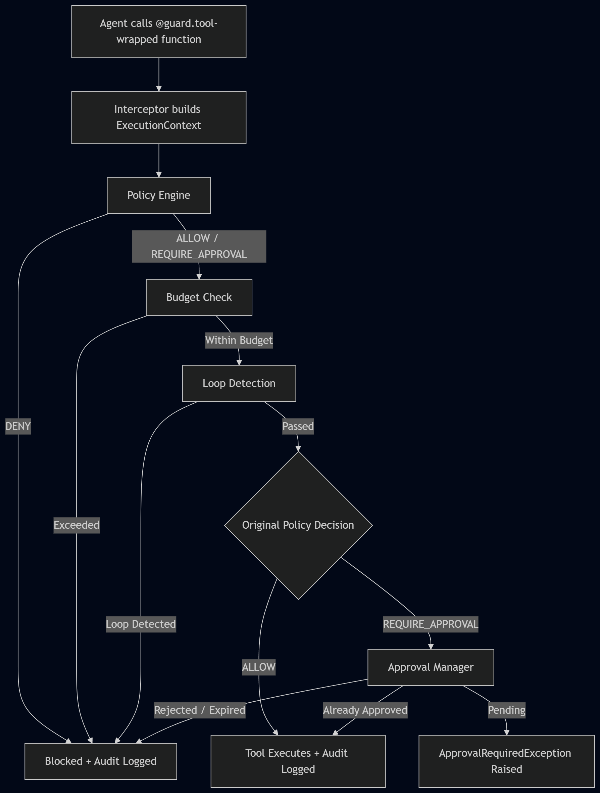

# AgentGuard Architecture

This document describes the internal runtime architecture, decision precedence, approval lifecycle, storage model, and execution flow.

## Runtime Decision Flow

  

## Runtime Execution Walkthrough

The runtime decision flow follows a deterministic sequence:

1. The agent calls a function wrapped with `@guard.tool`.
2. The Interceptor constructs an `ExecutionContext` containing the tool name, arguments, `run_id`, and execution metadata.
3. The Policy Engine evaluates the request against the loaded YAML policy.
4. If the policy returns **DENY**, execution stops immediately and the denial is written to the audit log.
5. If the policy returns **ALLOW** or **REQUIRE_APPROVAL**, the Budget Tracker verifies that the current run is still within its configured limits.
6. If the budget is exceeded, the request is denied regardless of the original policy decision.
7. If the budget check passes, the Loop Detector evaluates the recent execution history for the current `run_id`.
8. If a loop is detected, the request is denied regardless of the original policy decision.
9. If all runtime guards pass:

   * **ALLOW** → the tool executes and the decision is audited.
   * **REQUIRE_APPROVAL** → the Approval Manager checks whether an approval already exists.
10. If no approval exists (or it is still pending), AgentGuard raises `ApprovalRequiredException`. The host application is responsible for persisting state, obtaining human approval, and retrying the tool call.
11. When the same tool call is retried:

    * **APPROVED** → the tool executes.
    * **REJECTED** or **EXPIRED** → execution is denied and the outcome is recorded in the audit log.
